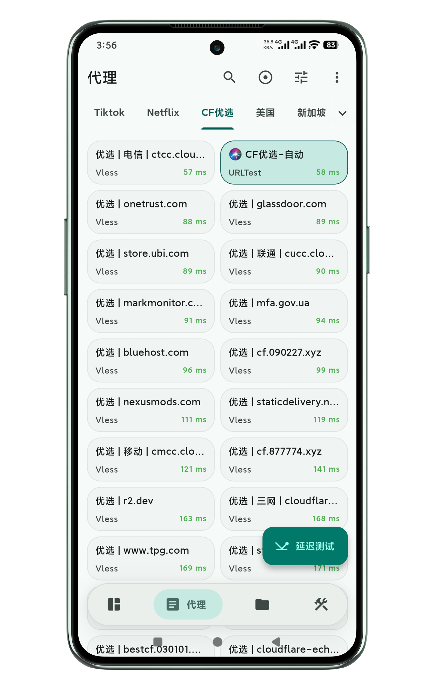
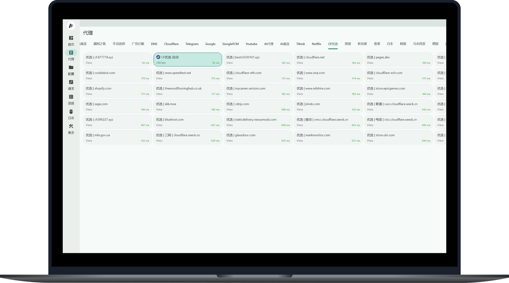

# Cloudflare 优选域名 API

## Cloudflare 优选域名，服务于 Cloudflare 免费代理搭建方案，优质域名即为优质节点。


- 优选域名通常依赖于那些在国际/国内互联表现极佳、且本身受到良好维护的“大厂”，它底层的 IP 调度和容灾由服务方或系统自动处理，**不需要用户天天操心换优选 IP**。

- 可以直接利用成熟的多线路解析的 DNS 服务商，实现多运营商优化，对复杂网络环境的兼容性更好。

- 优选域名往往使用了一些未被重点照顾、或者网络权重更高的 Cloudflare 边缘节点入口，能够有效避开部分运营商对常规 Cloudflare IP 段的本地阻断，连接成功率更高。

## 应用效果

- 具体表现取决于使用者当地网络环境，仅供参考。点击查看清晰图。

<p align="center">
  
</p>

## DOMAIN API

```
https://raw.githubusercontent.com/LancelotRar/best-cf-domains/main/best-cf-domain.txt
```


## 使用

- 可接入 [**Cmliu/edgetunnel**](https://github.com/cmliu/edgetunnel)-自定义订阅汇聚，从而将优选域名转换为代理节点。
- 非即时更新，视使用体验少量更新。

<p align="center">
  
</p>
